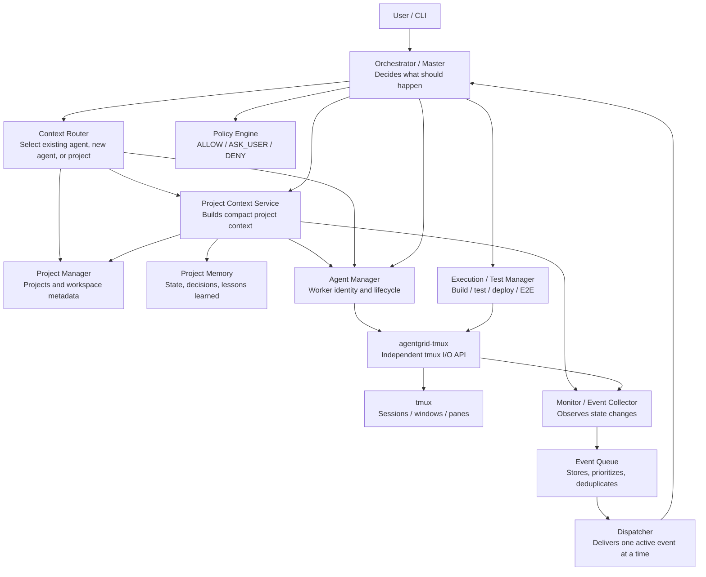
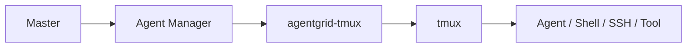
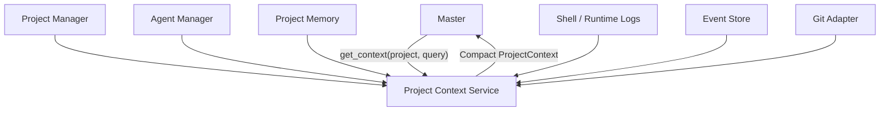
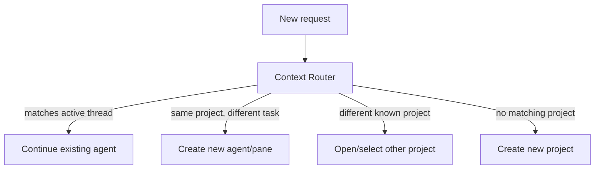
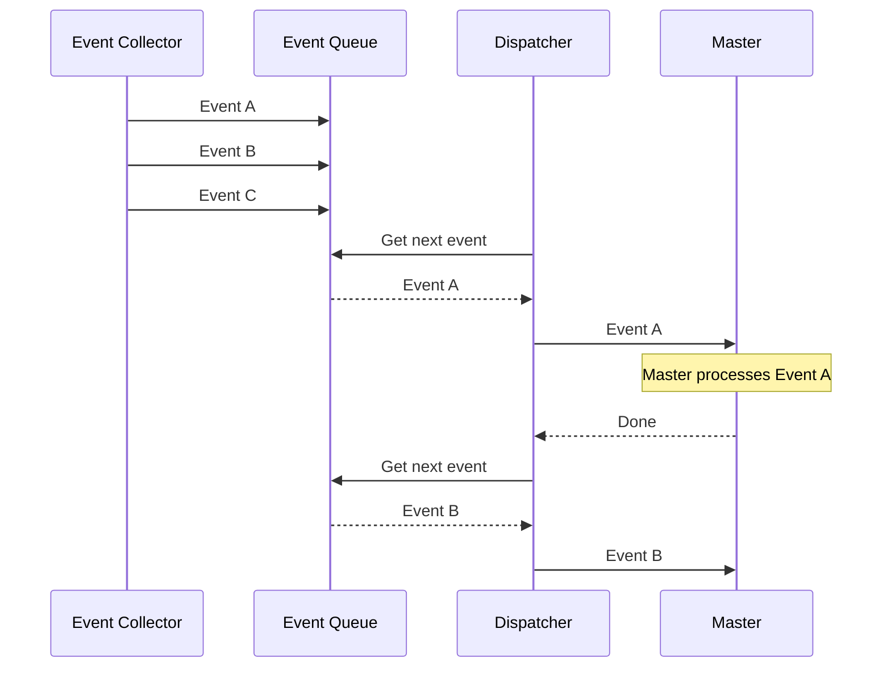
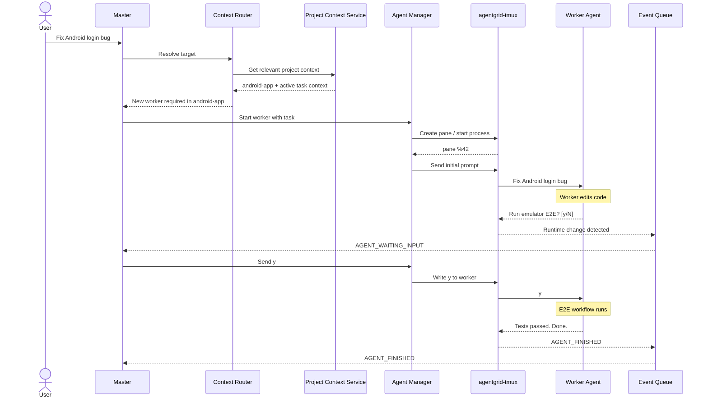
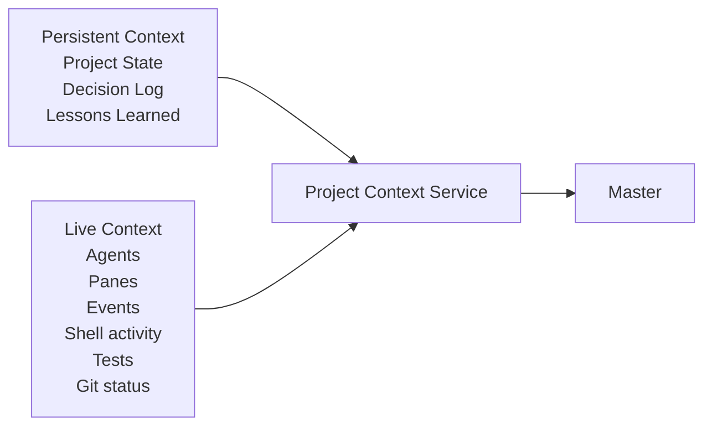
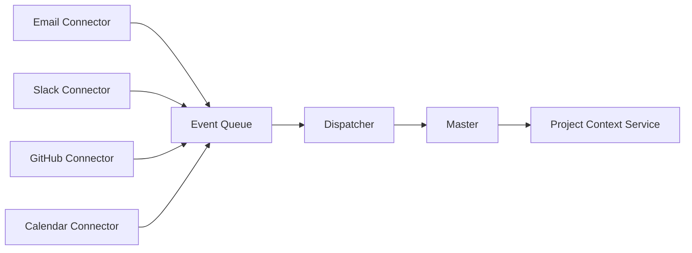

# AgentGrid Architecture

AgentGrid is a modular orchestration platform for projects, interactive agents, shells, events, project context, and automated workflows.

The architecture is intentionally independent of any specific AI provider or agent implementation. Codex, Claude Code, a shell process, or another interactive worker should be integrated through adapters rather than embedded into the core design.

## Design goals

- Modules can be started, tested, and developed independently.
- Modules communicate through clear APIs and structured data.
- Core modules do not depend on a specific AI provider.
- tmux-specific behavior is isolated behind one module.
- Important state is persisted outside of an AI conversation.
- The Master/Orchestrator receives compact context instead of reading every pane, log, or repository directly.
- Parallel workers can run independently while events are processed in a controlled way.

## High-level architecture



## Core communication principle

No module except `agentgrid-tmux` should execute tmux commands directly.



The same principle should be applied to other infrastructure integrations later. For example, GitHub-specific behavior should live behind a GitHub adapter, Android-specific behavior behind an Android execution adapter, and so on.

---

# Modules

## 1. `agentgrid-tmux`

### Responsibility

Independent tmux communication layer.

It knows nothing about Codex, projects, queues, or the Master. It only understands tmux resources and terminal I/O.

### Typical operations

- list sessions
- list windows
- list panes
- inspect a pane
- create a pane
- start a process in a pane
- read pane contents
- stream new pane output
- write text to a pane
- send keys such as `ENTER` or `C-c`
- verify that a pane is alive/reachable

### Example

```bash
agentgrid-tmux panes
agentgrid-tmux inspect %17
agentgrid-tmux read %17 --lines 100
agentgrid-tmux write %17 "pytest tests/"
agentgrid-tmux key %17 ENTER
```

### Why it is separate

Every other module can work with a stable API instead of knowing about `tmux capture-pane`, `tmux send-keys`, pane addressing, escaping, or tmux-specific errors.

---

## 2. Agent Manager

### Responsibility

Turns anonymous terminal panes into managed AgentGrid workers.

It gives workers stable identities and manages their lifecycle.

### Example state

```json
{
  "agent_id": "ag-42",
  "project_id": "android-app",
  "pane_id": "%17",
  "adapter": "codex",
  "state": "RUNNING",
  "task": "Fix login bug"
}
```

### Typical operations

- start agent
- stop agent
- restart agent
- list agents
- inspect agent
- send input to agent
- read agent output
- map `agent_id` to a tmux pane

### Example

Instead of higher-level code doing:

```bash
agentgrid-tmux write %17 "Fix login bug"
```

it does:

```bash
agentgrid-agent send ag-42 "Fix login bug"
```

The Agent Manager resolves `ag-42 -> %17` and delegates terminal I/O to `agentgrid-tmux`.

### Adapter model

The Agent Manager should support provider-specific adapters:

```text
agents/
  fake/
  codex/
  claude/
  other/
```

Core AgentGrid code must not require a specific provider.

---

## 3. Project Manager

### Responsibility

Owns project identity and project/workspace metadata.

### Typical information

- project ID
- display name
- repository/path
- current branch
- tmux workspace mapping
- active agents
- last activity
- project configuration

### Example operations

```text
open_project("android-app")
get_project("android-app")
list_projects()
close_project("android-app")
get_last_active_project()
```

The Project Manager should not decide which agent should receive a request. That belongs to the Context Router.

---

## 4. Project Memory

### Responsibility

Persistent knowledge owned by a project.

The initial memory model contains three categories:

### Project State

Where work currently stands.

Example:

```text
Charging stop bug is implemented.
Unit tests pass.
Android E2E test is still pending.
```

### Decision Log

Important decisions and why they were made.

Example:

```text
Decision: charging completion does not terminate the vehicle/charger pairing.
Reason: pairing represents physical connection, not charging activity.
```

### Lessons Learned

Reusable experience from successful and unsuccessful attempts.

Example:

```text
Attempt A failed because emulator API 33 does not expose the required behavior.
API 35 worked correctly.
Use API 35 for this E2E scenario.
```

This information belongs to the project, not to an individual AI conversation.

---

## 5. Project Context Service

### Responsibility

Builds a compact, structured context package for the Master or another agent.

The Master should not manually read every pane, shell log, git status, event, and historical note. It asks the Project Context Service for the required context.

### Example request

```text
get_context(
    project="android-app",
    query="charging stop bug",
    level="summary"
)
```

### Possible sources

- Project Manager
- Agent Manager
- Project Memory
- Monitor / Event Store
- Shell Logger
- Git adapter
- Execution/Test Manager
- `agentgrid-tmux` for limited live inspection

### Example result

```json
{
  "project": "android-app",
  "summary": "Charging stop bug is implemented; E2E remains pending.",
  "agents": [
    {
      "id": "ag-17",
      "state": "WAITING_INPUT",
      "task": "Fix charging stop bug",
      "last_message": "Run emulator E2E?"
    }
  ],
  "git": {
    "branch": "feature/charging-fix",
    "modified_files": 3
  },
  "relevant_decisions": [
    "Charging completion does not terminate pairing."
  ],
  "relevant_lessons": [
    "Use emulator API 35 for this scenario."
  ]
}
```

### Context levels

Suggested levels:

```text
summary
normal
detailed
```

The service should prefer relevant context over dumping all available history.



---

## 6. Context Router

### Responsibility

Determines where a new request belongs.

The router decides whether the request should:

1. continue an existing agent thread,
2. start a new agent in an existing project,
3. open another existing project,
4. or create a new project/workspace.

### Example

Project `android-app` currently contains:

```text
ag-17 -> "Implement charging scheduling"
ag-18 -> "Investigate Renault API"
```

New request:

```text
"Please add another unit test for the charging scheduler."
```

The router may choose `ag-17` because the request belongs to that existing context.

New request:

```text
"Fix database migration failure."
```

The router determines that neither active thread is appropriate and asks Agent Manager to create a new worker in the same project.



---

## 7. Monitor / Event Collector

### Responsibility

Continuously observes runtime changes and converts them into structured events.

The Master should not continuously poll dozens of terminal panes itself.

### Possible detected conditions

- worker process exited
- worker output changed
- worker appears to wait for input
- shell command failed
- SSH session disconnected
- test completed
- build failed

### Normalized events

Examples:

```text
AGENT_STARTED
AGENT_OUTPUT_CHANGED
AGENT_WAITING_INPUT
AGENT_FINISHED
AGENT_FAILED
PROCESS_EXITED
SSH_DISCONNECTED
COMMAND_FAILED
TEST_FINISHED
```

### Example event

```json
{
  "type": "AGENT_WAITING_INPUT",
  "project_id": "android-app",
  "agent_id": "ag-17",
  "priority": 80,
  "timestamp": "2026-09-14T13:00:00Z"
}
```

The Event Collector does not decide what to do about the event. It only detects and normalizes it.

---

## 8. Shell Logger

### Responsibility

Records activity performed manually in shell panes.

For normal shell commands, it should preserve enough information for a project agent to understand what was tried and whether it succeeded.

### Desired record

```text
COMMAND_START
command: ./gradlew test
timestamp: ...

stdout: ...
stderr: ...
exit_code: 1

COMMAND_END
```

This allows an agent to later determine:

```text
This command succeeded.
This command failed.
This exact error occurred.
```

Interactive TUI applications may require a separate strategy.

---

## 9. Event Queue

### Responsibility

Stores events until they can be processed.

This is important because many projects and agents may generate events at the same time.

### Responsibilities

- persist pending events
- prioritize
- deduplicate repeated events
- acknowledge completed events
- allow events to be parked

Example queue:

```text
1. priority 100 - production command requires user approval
2. priority 80  - agent ag-17 waiting for input
3. priority 50  - SSH session disconnected
4. priority 20  - background test finished
```

---

## 10. Dispatcher

### Responsibility

Delivers queued events to the Master in a controlled manner.

A major design requirement is that many workers may run in parallel, while the Master can process one active issue at a time.



An event waiting for the user should be parkable so unrelated work does not necessarily stop.

---

## 11. Policy Engine

### Responsibility

Determines whether an action may happen automatically.

### Standard result

```text
ALLOW
ASK_USER
DENY
```

### Examples

```text
Run unit tests              -> ALLOW
Restart local worker        -> ALLOW
Delete project directory    -> ASK_USER
Force-push protected branch -> ASK_USER or DENY
```

The policy should be separate from the Master so safety rules are explicit and testable.

---

## 12. Execution / Test Manager

### Responsibility

Runs project-specific build, deploy, validation, and end-to-end workflows.

The core service is generic. Platform-specific functionality belongs to adapters.

Possible adapters:

```text
Android / ADB / Emulator
Web / Playwright
SSH
Docker
REST API
Desktop UI
```

### Android example

```text
build
  -> start/reuse emulator
  -> deploy APK
  -> launch app
  -> interact with UI
  -> inspect values
  -> collect logcat
  -> determine result
```

The project agent can use the result to modify the implementation and repeat the workflow.

---

## 13. Orchestrator / Master

### Responsibility

High-level reasoning and coordination.

The Master should decide what should happen, but infrastructure work should be delegated to the corresponding modules.

### Master responsibilities

- receive user requests
- receive dispatched system events
- ask Context Router where work belongs
- request project context
- delegate work to agents
- consult Policy Engine
- request tests/builds from Execution Manager
- present decisions/questions to the user

### The Master should not

- execute raw tmux commands
- be the only storage of project knowledge
- continuously poll all terminal panes
- directly implement provider-specific behavior

The Master should be replaceable or restartable without losing project state.

---

# Example end-to-end workflow

User asks:

```text
Fix the Android login bug.
```



---

# Live context vs persistent context

Project context has two major sources.



This separation allows AgentGrid to survive Master restarts and reconstruct the current situation from persisted knowledge plus live runtime state.

---

# Suggested implementation order

The modules should be independently runnable and testable. A practical implementation order is:

```text
1. agentgrid-tmux
2. Agent Manager
3. Monitor / Event Collector
4. Event Queue + Dispatcher
5. Project Manager
6. Project Memory
7. Project Context Service
8. Context Router
9. Policy Engine
10. Orchestrator / Master
11. Execution / Test Manager
12. External connectors
```

The first milestone is intentionally small:

```text
agentgrid-tmux
    -> create/find pane
    -> handshake
    -> write input
    -> read output
    -> detect process exit
```

The second milestone adds worker identity:

```text
Agent Manager
    -> create agent ID
    -> map agent to pane
    -> start worker
    -> send/read through agentgrid-tmux
    -> stop/restart worker
```

Only after these low-level behaviors are reliable should higher-level reasoning and orchestration be added.

---

# Future V2 connectors

External systems should later plug into the same event-driven architecture.

Examples:

- email
- Slack
- GitHub
- Google Calendar
- CI/CD systems
- monitoring systems



A connector should emit normalized events rather than introducing provider-specific logic into the Master.
