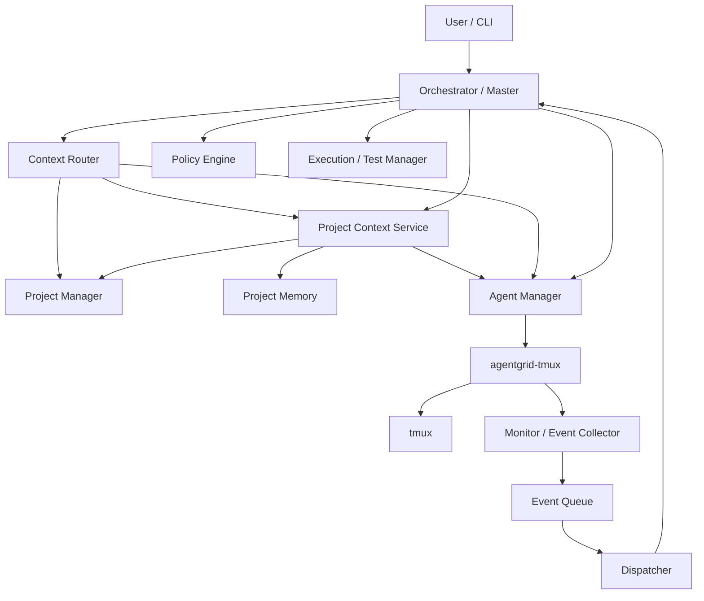
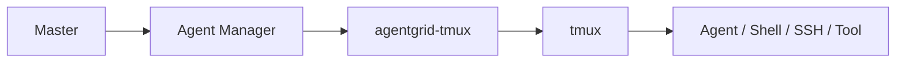
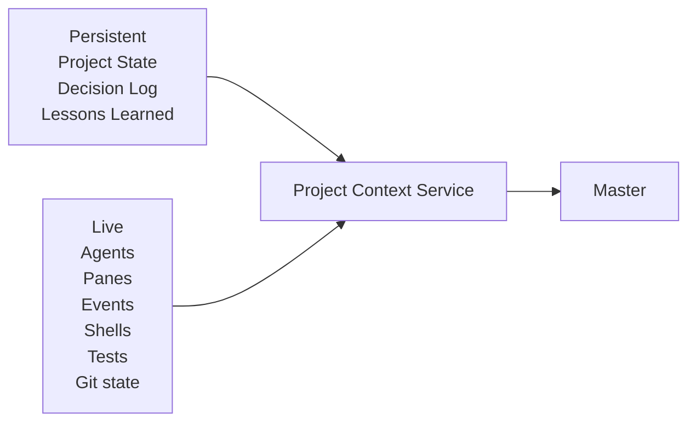

# Architecture

## Design goals

- Modules can be started, tested, and developed independently.
- Modules communicate through clear APIs and structured data.
- Core modules do not depend on a specific AI provider.
- tmux-specific behavior is isolated behind `agentgrid-tmux`.
- Important state is persisted outside AI conversations.
- The Master receives compact context instead of reading every pane and log directly.
- Many workers may run in parallel while the Master processes events in a controlled sequence.

## High-level architecture



## Runtime composition

`agentgrid-orchestrator/agentgrid_orchestrator/runtime.py` is the current composition root. It is allowed to instantiate concrete module implementations and wire them together while lower-level modules keep depending on their direct interfaces.

The implemented V1 vertical slice uses the deterministic `fake` agent adapter by default:

```text
User request
    -> Orchestrator
    -> Project Context Service
    -> Context Router
    -> Agent Manager
    -> agentgrid-tmux
    -> Fake Agent
```

Runtime observations use the event path:

```text
Fake Agent / runtime
    -> Monitor
    -> Event Queue
    -> Dispatcher
    -> Orchestrator
```

The MVP `codex` adapter can replace the fake adapter at the Agent Manager boundary and run the local Codex CLI in tmux. Codex-specific protocol parsing, semantic completion detection, and approval-state interpretation are not implemented yet.

## Core communication principle



The same rule applies to other infrastructure: GitHub, Android, browsers, external services, and AI providers should be hidden behind adapters rather than embedded in core modules.

## Live vs persistent context



The Master is a consumer of project context, not the source of truth.
