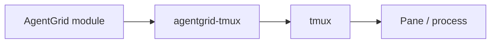

# `agentgrid-tmux`

## Responsibility

Independent tmux communication layer. It knows nothing about projects, AI providers, queues, or the Master.

## Typical operations

- list sessions, windows, and panes
- inspect a pane
- create a pane
- start a process in a pane
- read pane contents
- stream new pane output
- write text
- send keys such as `ENTER` or `C-c`
- verify that a pane is reachable/alive

## Example

```bash
agentgrid-tmux panes
agentgrid-tmux inspect %17
agentgrid-tmux read %17 --lines 100
agentgrid-tmux write %17 "pytest tests/"
agentgrid-tmux key %17 ENTER
```

## Boundary

Other modules should never call `tmux capture-pane`, `tmux send-keys`, or other raw tmux commands directly.


