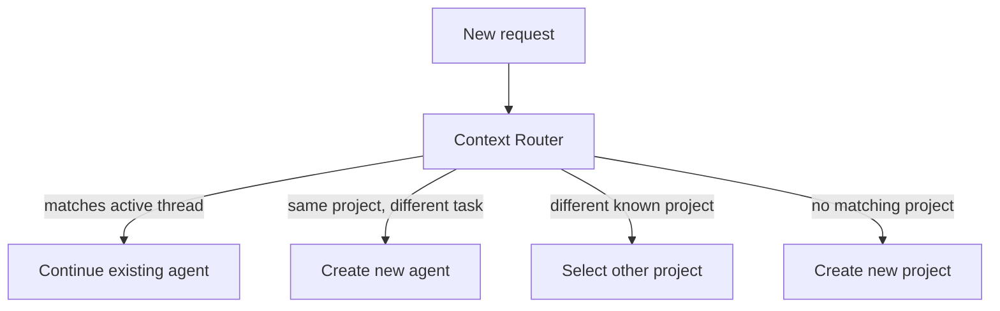

# Context Router

## Responsibility

Determines where a new request belongs.

A request can:

1. continue an existing agent thread,
2. start a new agent in the same project,
3. select another known project,
4. create a new project/workspace.

## Example

Existing workers:

```text
ag-17 -> Implement charging scheduling
ag-18 -> Investigate Renault API
```

Request:

```text
Add another unit test for the charging scheduler.
```

This likely continues `ag-17`.

Request:

```text
Fix database migration failure.
```

This likely requires a new worker/pane.


