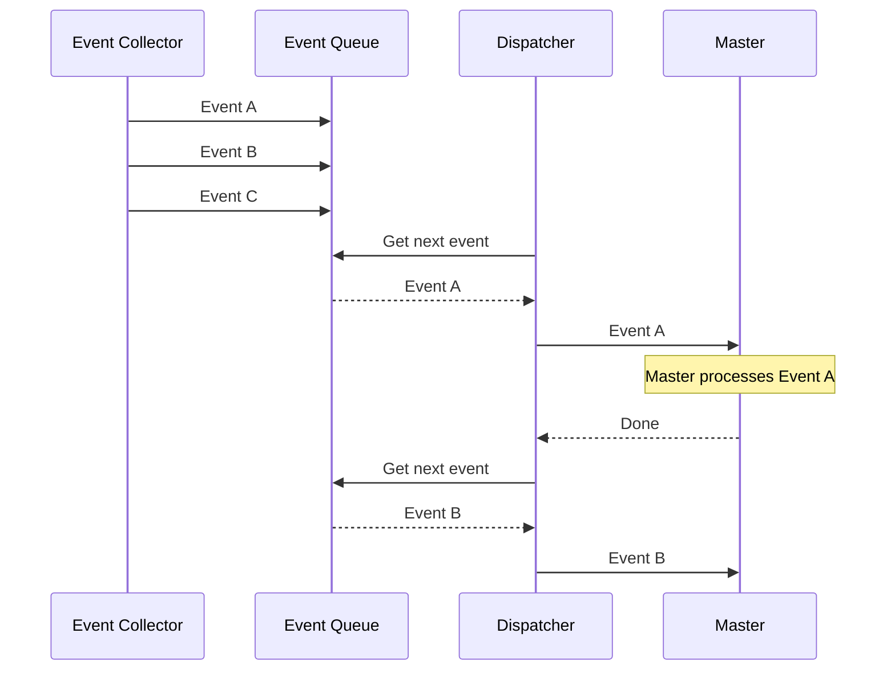

# Dispatcher

## Responsibility

Delivers queued events to the Master in a controlled manner.

Many workers can run in parallel while the Master processes one active issue at a time.

An event waiting for the user should be parkable so unrelated work can continue.
