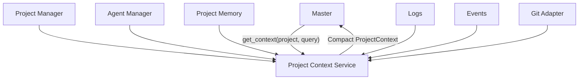

# Project Context Service

## Responsibility

Builds a compact, structured context package for the Master or another agent.

The Master should not manually read every pane, shell log, event, Git state, and historical note.

## Example request

```text
get_context(
    project="android-app",
    query="charging stop bug",
    level="summary"
)
```

## Sources

- Project Manager
- Agent Manager
- Project Memory
- Monitor / Event Store
- Shell Logger
- Git adapter
- Execution / Test Manager
- `agentgrid-tmux` for limited live inspection

## Example result

```json
{
  "project": "android-app",
  "summary": "Charging stop bug implemented; E2E pending.",
  "agents": [
    {
      "id": "ag-17",
      "state": "WAITING_INPUT",
      "task": "Fix charging stop bug",
      "last_message": "Run emulator E2E?"
    }
  ],
  "relevant_decisions": [
    "Charging completion does not terminate pairing."
  ]
}
```

Suggested context levels are `summary`, `normal`, and `detailed`.


