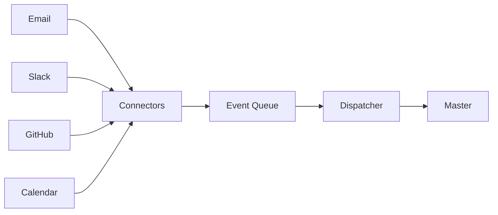

# Roadmap

## Recommended implementation order

1. `agentgrid-tmux`
2. Agent Manager
3. Monitor / Event Collector
4. Event Queue
5. Dispatcher
6. Project Manager
7. Project Memory
8. Project Context Service
9. Context Router
10. Policy Engine
11. Orchestrator / Master
12. Execution / Test Manager

Each module should be runnable and testable independently before depending on it from higher layers.

## First milestone

```text
agentgrid-tmux
    -> create/find pane
    -> handshake
    -> write input
    -> read output
    -> detect process exit
```

No AI is required for this milestone.

## V2 direction

External connectors can feed the same event architecture:



A connector should emit normalized events instead of introducing provider-specific logic into the Master.
