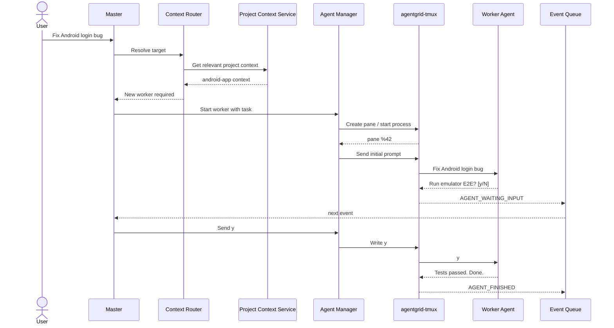
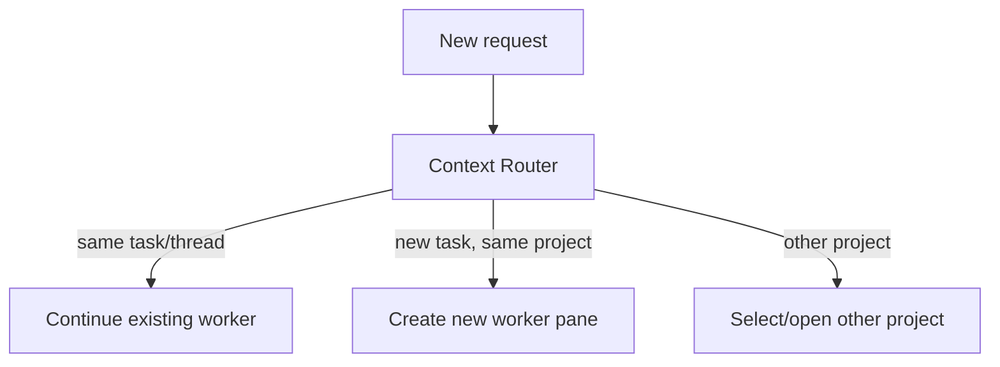

# Workflows

## New user request

Example request:

```text
Fix the Android login bug.
```



## Context-aware pane routing



## Event processing

Workers are parallel; Master event handling is controlled and normally sequential:

```text
workers -> Monitor -> Event Queue -> Dispatcher -> Master
```

`WAITING_USER` events may be parked while unrelated work continues.
